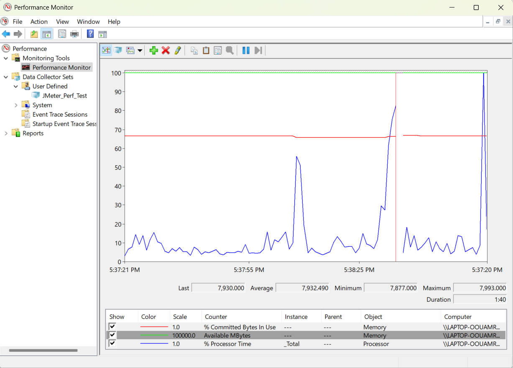

# JMeter Performance Monitoring Summary

## 📊 Performance Metrics Summary

**Test Machine:** `LAPTOP-OUOAMRU5`  
**Monitoring Tool:** Windows Performance Monitor (PerfMon)  
**Test Duration:** 1 minute 40 seconds  
**Date Captured:** 2025-06-01 12:09:32

### 🧠 Memory Usage
- **% Committed Bytes In Use:** Indicates the committed virtual memory in use.  
  - **Average:** ~68%
- **Available MBytes:** Represents the physical memory available for allocation.
  - **Average:** ~7932 MB  
  - **Minimum:** 7877 MB  
  - **Maximum:** 7993 MB  

### ⚙️ CPU Usage
- **% Processor Time (_Total):** Shows the CPU usage across all cores.  
  - **Average:** ~10.83%  
  - **Peak Usage:** ~88.63%  

## 📈 Observations
- The CPU usage spikes intermittently, peaking around 88% during the test.
- Memory availability remains consistent, indicating stable RAM consumption.
- The system handled the JMeter load without significant resource saturation.

## ✅ Conclusion
The system performed reliably under the current JMeter test scenario. CPU and memory usage stayed within safe thresholds, making it suitable for moderate test loads.

---

*Generated on 2025-06-01 12:09:32*
